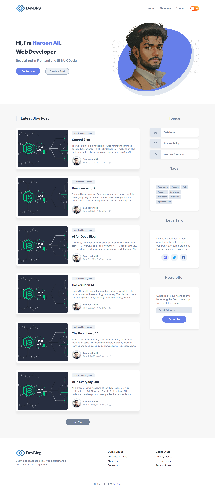
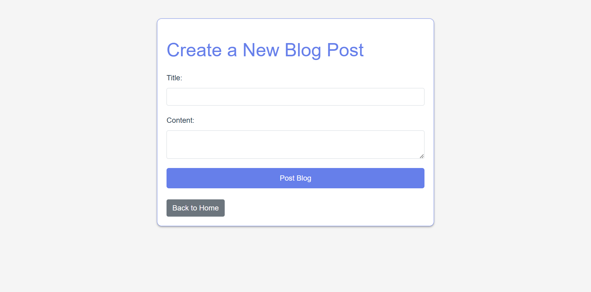

# Blog Project

A simple blog project built using **Python** with the **Django** and **Django Rest Framework** frameworks.

## Table of Contents

- [Project Overview](#project-overview)
- [Features](#features)
- [Requirements](#requirements)
- [Installation](#installation)
- [Usage](#usage)
- [API Endpoints](#api-endpoints)
- [Screenshots](#screenshots)
- [Tools Used](#tools-used)
- [Contributing](#contributing)
- [License](#license)

## Project Overview

This project is a simple blog application that allows users to create, read, update, and delete (CRUD) blog posts. The project uses Django as the backend framework and Django Rest Framework for building the API.

## Features

- User can create new blog posts
- User can view all blog posts
- User can update existing blog posts
- User can delete existing blog posts
- API endpoints for CRUD operations

## Requirements

- Python 3.8+
- Django 5.1.3
- Django Rest Framework 3.14.0

## Installation

Follow these steps to set up the project:

1. **Clone the repository**
   ```bash
   git clone https://github.com/Haroon966/Simple_Blog_Project
   ```

2. **Navigate to the project directory**
   ```bash
   cd blog-project
   ```

3. **Install the required dependencies**
   ```bash
   pip install -r requirements.txt
   ```

4. **Run the database migrations**
   ```bash
   python manage.py migrate
   ```

   This command applies the migrations to set up your database.

5. **Start the development server**
   ```bash
   python manage.py runserver
   ```

   The development server will start running on `http://localhost:8000/`.

## Usage

1. **View the Blog Posts:**
   Open your web browser and navigate to `http://localhost:8000/`. You will see the home page with the list of blog posts.

2. **Use the API Endpoints:**
   To interact with the blog posts, you can use the following API endpoints:

   - **Retrieve all blog posts**
     ```bash
     GET http://localhost:8000/api/posts/
     ```

   - **Create a new blog post**
     ```bash
     POST http://localhost:8000/api/posts/
     ```
     Body:
     ```json
     {
       "title": "Your blog title",
       "content": "Content of your blog post"
     }
     ```

   - **Retrieve a single blog post**
     ```bash
     GET http://localhost:8000/api/posts/<int:pk>/
     ```
     Replace `<int:pk>` with the ID of the blog post you want to retrieve.

   - **Update an existing blog post**
     ```bash
     PUT http://localhost:8000/api/posts/<int:pk>/
     ```
     Body:
     ```json
     {
       "title": "Updated title",
       "content": "Updated content"
     }
     ```

   - **Delete a blog post**
     ```bash
     DELETE http://localhost:8000/api/posts/<int:pk>/
     ```

   Replace `<int:pk>` with the ID of the blog post you want to delete.

## API Endpoints

- `GET /api/posts/`: Retrieve all blog posts
- `POST /api/posts/`: Create a new blog post
- `GET /api/posts/<int:pk>/`: Retrieve a single blog post by ID
- `PUT /api/posts/<int:pk>/`: Update a single blog post by ID
- `DELETE /api/posts/<int:pk>/`: Delete a single blog post by ID

## Screenshots

### Main Home Page


### Form to Post the Blog


## Tools Used

- **Python** - Programming language
- **Django** - Web framework
- **Django Rest Framework** - API framework
- **SQLite** - Default database
- **Bootstrap** - Frontend styling
- **Postman** - API testing tool
  <div align="center">
  
  
  
  
  
  
</div>

## Contributing

Contributions are welcome! If you'd like to contribute to the project, please follow these steps:

1. Fork the repository
2. Create a new branch (`git checkout -b feature-branch`)
3. Make your changes
4. Commit your changes (`git commit -m 'Add new feature'`)
5. Push to the branch (`git push origin feature-branch`)
6. Open a pull request from your fork to the original repository

## License

This project is licensed under the MIT License. See the LICENSE file for more information.
